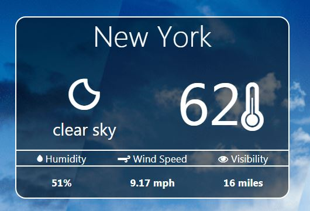
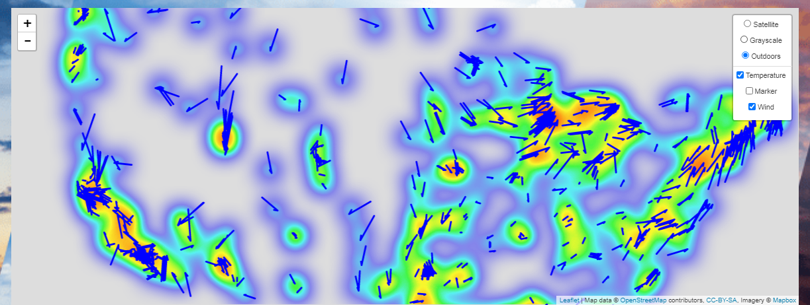

# Know Your Weather!
<h3>Objective:</h3> 
To create a user interactive weather dashboard using Javascript, HTML, CSS, Python Flask and MongoDB
<h3>Data Source:</h3>
Open Weather Map API 

A user interactive dashboard which allows the user to choose a US city and displays its weather conditions via three main elements:
1. Weather card
2. Scatter plot
3. Leaflet map

The weather card displays the present day weather condition 
 
 
The scatter plot which allows the user to toggle between temperature,humidity and pressure over a period of 7 days for a particular city 
 
 
A leaflet map giving the the direction and magnitude of the wind speed in all the cities of the present day

