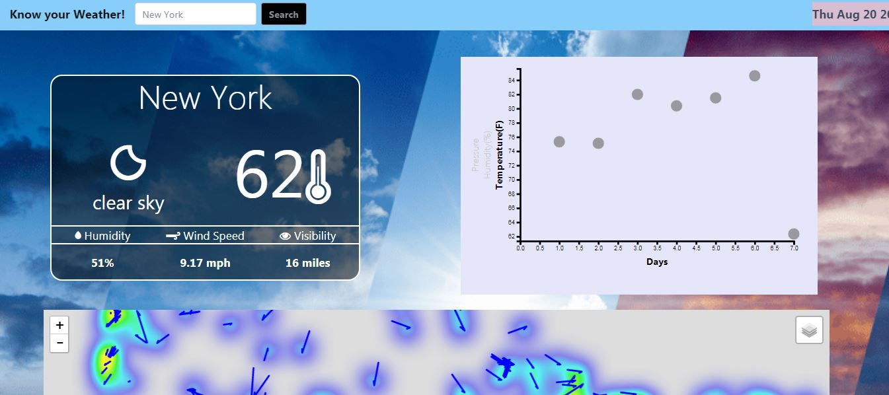

# Know Your Weather!
<h3>Objective:</h3> 
To create a user interactive weather dashboard using Javascript, HTML, CSS, Python Flask and MongoDB
<h3>Data Source:</h3>
OpenWeather API
<h3>Methodology:</h3>
OpenWeather API was used to collect the weather data of the chosen 900+ US cities and the data was stored in MongoDB Atlas using Amazon Web Services. This data was then accessed through RESTful API routes created using Python flask. The data is the rendered on the html page in form of three visualizations created using javascript, D3.js and leaflet.js.   
<h3>Overview:</h3>

A user interactive dashboard which allows the user to choose a US city and displays its weather conditions via three main elements:
1. Weather card
2. Scatter plot
3. Leaflet map

The weather card displays the present day weather condition of the chosen city 
 
 
The scatter plot which allows the user to toggle between temperature,humidity and pressure over a period of 7 days for a particular city 
 
 
A leaflet map giving the the direction and magnitude of the wind speed in all the cities in the database for the present day

